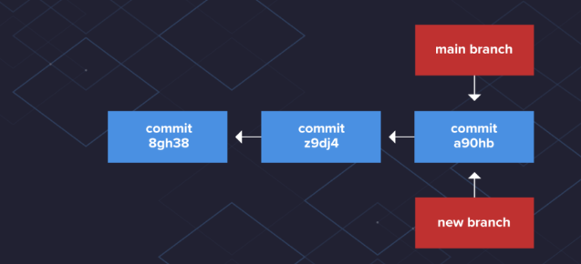

# SE-Assignment-4
Assignment: GitHub and Visual Studio
Instructions:
Answer the following questions based on your understanding of GitHub and Visual Studio. Provide detailed explanations and examples where appropriate.

Questions:
Introduction to GitHub:

What is GitHub, and what are its primary functions and features? Explain how it supports collaborative software development.
Repositories on GitHub:
Git hub is a web based platform that makes use of Git to host and manage code repositories for software developers
The primary functions for git hub include:
Centralized Repository which serves as a central location for all project files, allows easy access for memebers to access, update, and manage the codebase.
Version Control: Git’s version control capabilities, integrated into GitHub, enable multiple developers to work on different parts of the project simultaneously without overwriting each other's changes.
Branching and Merging which makes it easier for developers to create branches to work on features or bug fixes in isolation. Once the work is complete, branches can be merged back into the main codebase.
Code Reviews and Pull Requests: The pull request feature facilitates peer reviews, ensuring that all changes are reviewed and approved by other team members before they are merged into the main codebase.
Issue Tracking and Project Management: GitHub’s issue tracking and project management tools help teams stay organized, prioritize tasks, and track progress.
Communication and Collaboration: GitHub’s commenting system on commits, pull requests, and issues fosters communication among team members, allowing for discussions and collaborative problem-solving.
Documentation within the repository (READMEs) ensures that all team members and contributors have access to necessary information about the project.

What is a GitHub repository? Describe how to create a new repository and the essential elements that should be included in it.
A GitHub repository is a storage space where a developers project's files, including code, documentation, and other resources, are kept. Each repository can have multiple branches and track the history of changes made to the files. Repositories can be public or private
How to Create a New Repository:
Sign in to GitHub and sign in to your account.
Navigate to the Repositories Page by
Click on your profile picture in the top-right corner of the page. Select "Your repositories" from the dropdown menu.
Create a New Repository by clicking "New" button on the repositories page.
Choose a unique name for your repository and optionally add a short description of your project
Choose whether the repository will be public or private.
choose to initialize the repository with a README file, which is a good practice as it provides an overview of the project. You can also add a .gitignore file to specify files that Git should ignore, and a license to define the terms under which the project can be used and distributed.

Essential elements to Include in a Repository:
README.md:
A README file provides an overview of the project, including what it does, how to install and use it, and any other pertinent information. This file is written in Markdown and is usually the first thing visitors to the repository will read.
LICENSE:
A license file specifies the terms under which others can use, modify, and distribute your code. This is important for open-source projects to clarify legal permissions.
.gitignore:
A .gitignore file specifies which files and directories Git should ignore. This is useful for excluding temporary files, build artifacts, and other files that do not need to be tracked.
Source Code Files
Documentation:
Additional documentation files (besides the README) that provide detailed information about the project, such as API documentation, tutorials, and usage guides.
Contributing Guidelines (CONTRIBUTING.md):
Guidelines for how others can contribute to the project. This can include information on coding standards, submitting issues, and creating pull requests.
Issue and Pull Request Templates:
Templates for creating issues and pull requests can help maintain consistency and provide necessary information to maintainers and contributors.
CI/CD Configuration:
Configuration files for Continuous Integration/Continuous Deployment (CI/CD) tools, such as GitHub Actions, Travis CI, or CircleCI, if applicable.
Changelog (CHANGELOG.md):
A changelog file that documents the changes made in each version of the project.
Tests:
Unit tests and other test files that help ensure the quality and correctness of the code.

Version Control with Git:
Explain the concept of version control in the context of Git. How does GitHub enhance version control for developers?
Version control is a system that records changes to a file or set of files over time, together with github they work seamlessly to enable developers mangae their work effeciently.
Branching and Merging in GitHub: In VS in us with github, one can use the commands such as: to
git branch
to list your branches. a * will appear next to the currently active branch
git branch [branch-name]
create a new branch at the current commit
git checkout
switch to another branch and check it out into your working directory
git merge [branch]
merge the specified branch’s history into the current one
git log
show all commits in the current branch’s history

What are branches in GitHub, and why are they important? Describe the process of creating a branch, making changes, and merging it back into the main branch.
Branches allow users to develop features, fix bugs, or safely experiment with new ideas in a contained area of your repository
In github, the default branch is 'main' in any new repository.
A branch you create to build a feature is commonly referred to as a feature branch or topic branch.

To create a branch,
Use the command, git init which initializes the git repository to create the main branch as a default
To create a branch, use the 'git branch' command followed by the name of the branch
when you create a commit,Git identifies that snapshot of files with a unique SHA-1 hash.
As you continue to create commits, Git tracks the changes made
To merge to the main branch  by using the same 'git merge main' command.

Pull Requests and Code Reviews:
What is a pull request in GitHub, and how does it facilitate code reviews and collaboration? Outline the steps to create and review a pull request.
A pull request is a proposal to merge a set of changes from one branch into another. In a pull request, developers can review and discuss the proposed set of changes before they integrate the changes into the main codebase
In github, click on your repository name, click  Pull requests.
In the list of pull requests, click the pull request you'd like to review.
On the pull request, click  Files changed.

GitHub Actions:
Explain what GitHub Actions are and how they can be used to automate workflows. Provide an example of a simple CI/CD pipeline using GitHub Actions.
GitHub Actions is a feature of GitHub that allows users to automate workflows directly from their repositories. These workflows can be triggered by events such as pushing code, creating pull requests, or scheduling tasks. GitHub Actions provides a way to define these workflows in YAML files within the repository, making it easy to automate tasks such as testing, building, and deploying code.

Key Concepts of GitHub Actions:
Workflow:
A workflow is an automated process defined in a YAML file that is triggered by specific events. Workflows are stored in the .github/workflows directory of a repository.
Event:
An event is an activity that triggers a workflow. Examples of events include push, pull_request, schedule, and release.
Job:
A job is a set of steps that are executed on the same runner. Jobs run in parallel by default but can be configured to run sequentially.
Step:
A step is an individual task that is part of a job. Steps can run commands or use actions.
Runner:
A runner is a server that executes the steps of a job. GitHub provides hosted runners, or you can use self-hosted runners.
Action:
An action is a reusable unit of code that can be used as a step in a workflow. Actions can be created by the community or by you.
An example of a Simple CI/CD Pipeline using GitHub Actions:
create a simple CI/CD pipeline for a Node.js project. The pipeline will:

Run tests when code is pushed to the repository.
Build the project if the tests pass.
Deploy the project if the build is successful (for simplicity, this example will just simulate deployment).
Step 1: Set Up the Repository:
Ensure you have a Node.js project with a package.json file.
Create a directory .github/workflows in the root of your repository.
Step 2: Create a Workflow File:
Create a file named ci-cd-pipeline.yml inside the .github/workflows directory.

Introduction to Visual Studio:
What is Visual Studio, and what are its key features? How does it differ from Visual Studio Code?
It's a comprehensive integrated development environment (IDE) that you can use to write, edit, debug, and build code, deploy your app. Visual Studio includes compilers, code completion tools, source control, extensions, and many other features to enhance every stage of the software development process. It differs with visual studio code which is a code editor redefined and optimized for building and debugging modern web and cloud applications

Integrating GitHub with Visual Studio:
Describe the steps to integrate a GitHub repository with Visual Studio. How does this integration enhance the development workflow?
Step 1: Install GitHub Extension for Visual Studio:
Step 2: Clone GitHub Repository:
In Visual Studio, go to "Team Explorer" and click on "Clone" under the "Local Git Repositories" section.
Enter the URL of the GitHub repository and choose a local path to clone the repository.
Step 3:Commit and Push Changes:Make changes to your code in Visual Studio.
In the "Team Explorer" window, stage your changes, add a commit message, and commit the changes.
Click on "Sync" to push the committed changes to the GitHub repository.
Step 4: Pull Changes from GitHub: To pull changes made by others, click on "Sync" in the "Team Explorer" window and then click "Pull."

Benefits of Integration
THe integration with GitHub allows for easy collaboration with other developers by enabling version control, pull requests, and code reviews.
Developers can access GitHub features such as issues, and project boards directly from Visual Studio.
Efficient Workflow: The integration streamlines the development workflow by providing a familiar interface for managing code, branches, and pull requests without leaving Visual Studio.
Integration with GitHub can be leveraged to set up automated build and deployment processes using continuous integration and continuous deployment (CI/CD) tools

Debugging in Visual Studio:
Explain the debugging tools available in Visual Studio. How can developers use these tools to identify and fix issues in their code?
Collaborative Development using GitHub and Visual Studio:
Debugging Tools in Visual Studio
To run or debug a simple app in VS Code, select Run and Debug on the Debug start view or press F5 and VS Code will try to run your currently active file

Visual Studio provides a range of powerful debugging tools to help developers identify and fix issues in their code. Some of the key debugging tools available in Visual Studio include:

Breakpoints allows developers to set breakpoints in their code,  pause the execution at specific lines or conditions. The developers can inspect the state of variables and objects at that point in the code.
Watch Windows: Developers can use watch windows to monitor the values of variables and expressions as they change during the execution of the program.
Locals Window: This window displays the variables and their values within the current scope, making it easier for developers to track the state of their variables.
Call Stack: The call stack window shows the hierarchy of method calls that led to the current point in the code, helping developers understand the flow of their program.
Immediate Window: Developers can use the immediate window to execute code and evaluate expressions during debugging, which can be helpful for testing and troubleshooting.
Debugging Toolbar: Visual Studio provides a debugging toolbar with essential controls such as stepping into, over, and out of code, as well as options for restarting or stopping the debugging session.

Discuss how GitHub and Visual Studio can be used together to support collaborative development. Provide a real-world example of a project that benefits from this integration.
GitHub and Visual Studio can be used together to support collaborative development through their integration in version control, code review, and project management.
Version Control
GitHub enables developers by hosting Git repositories, one can track changes, manage branches, and merge codes. Visual Studio integrates seamlessly with GitHub, thus users to clone, commit, and push changes directly from the IDE.
Code Review
GitHub's pull request feature enables developers to perform code review. Team players can  comment on codes, suggest changes, and approve or request further modifications. Visual Studio's integration with GitHub enables users to code easily.
Project Management
GitHub offers issue tracking and project boards help developers organize and prioritize tasks.This intergration with Visual Studio enables users to view and manage their work, track progress, and link commits to certain issues directly from the IDE.
Real-World Example
An example of a project that benefits from this integration is a web application development project. The developers in the project use GitHub to host the project's codebase, manage feature branches, and coordinate code reviews. The intergration with visual Studio allows the developers to work collaboratively on the codebase, be able to review each other's work, and manage project tasks without switching between multiple tools.
The use of github and visual studio enable teams in the project to work collaboratively and effectively. 

References
https://www.geeksforgeeks.org
https://www.studocu.com
https://code.visualstudio.com
https://git-scm.com
https://docs.github.com
https://learn.microsoft.com

Submission Guidelines:
Your answers should be well-structured, concise, and to the point.
Provide real-world examples or case studies wherever possible.
Cite any references or sources you use in your answers.
Submit your completed assignment by [due date].
